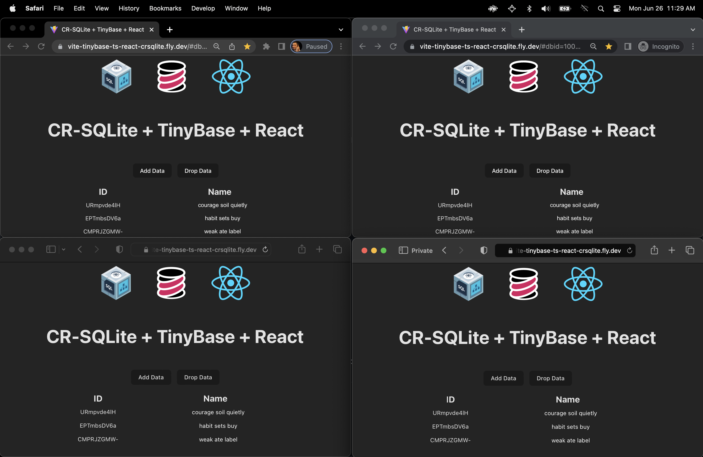

# vite-tinybase-ts-react-crsqlite

This is a [Vite](https://vitejs.dev/) template for a simple app, using TypeScript and React, that
integrates [TinyBase](https://tinybase.org/) with [Vulcan](https://github.com/vlcn-io)'s cr-sqlite to provide persistence and synchronization
across clients.

It is a fork of the awesome [Vulcan
vite-starter](https://github.com/vlcn-io/vite-starter) app, with small changes
to introduce TinyBase into the view layer. All the credit for the magic goes to
the [cr-sqlite](https://github.com/vlcn-io/cr-sqlite) project!

Try a deployed demo
[here](https://vite-tinybase-ts-react-crsqlite.fly.dev).
It should look like this:



## Instructions

1. Make a copy of this template into a new directory:

```sh
npx degit tinyplex/vite-tinybase-ts-react-crsqlite my-tinybase-app
```

2. Go into the directory:

```sh
cd my-tinybase-app
```

3. Install the dependencies:

```sh
npm install
```

4. Run the application:

```sh
npm run dev
```

5. Go the URL shown and enjoy! Open up multiple windows to see the
   synchronization in all its glory.

## License

This template has no license, and so you can use it however you want!
[TinyBase](https://github.com/tinyplex/tinybase/blob/main/LICENSE),
[cr-sqlite](https://github.com/vlcn-io/cr-sqlite/blob/main/LICENSE), and
[Vite](https://github.com/vitejs/vite/blob/main/LICENSE) themselves are each MIT
licensed.
